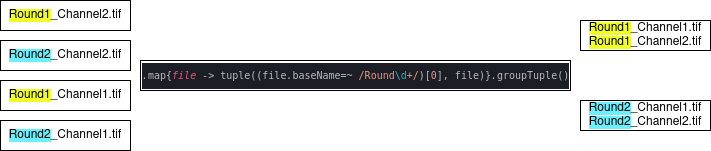

# STAPLE: Spatial Transcriptomics Automated PipeLinE 
Author: David Wouters


This repository represents the code-base behind the author's dissertation of his master in bioinformatics of 2021.
It contains an entire end-to-end image processing and analysis pipeline for Spatial Transcriptomics. 
Currently it supports both ISS data and MERFISH data.

### What you need to have installed:
- Nextflow: https://www.nextflow.io/docs/latest/getstarted.html
- (Ana)Conda: https://conda.io/projects/conda/en/latest/user-guide/install/index.html

### Running the pipeline
- Update your version of the repo to the most recent stable version:
- 	```bash
	nextflow pull WoutDavid/ST-nextflow-pipeline ; cd communISS
	```
- Create a conda environment containing all the dependencies of the current pipeline, and activate it
- 	```bash
	conda env create --file=staple.yml --prefix ./staple_env/
	conda activate ./staple_env/
	```
- Create a personal config file containing all the parameters you'll need for the functionality you want:
- ```bash
	nextflow config -profile conda,iss >> standard_iss_experiment.config
	```
- *Note that this config file is where you change everything that you want to change, such as data directory, output directory, image format etc.*
For an explanation on all possible parameters you might encounter in the generated configs, check configs/*_explanation.txt

- After making the needed changes to the config file, you can run pipeline by specifying an entry point with "-entry", which takes as argument the name of one of the workflows included in the main.nf file.  
- ```bash
  nextflow -C standard_iss_experiment.config run  main.nf	\
						-entry iss							\
						--with_conda staple.yml			\
	```

### Things you might want to know
- Nextflow's philosophy is technically to parallelize processes based on simple in and output. However in a usecase such as an ST expermiment, a higher control over input is necessary, since sometimes you need to combine information coming from different axes, such as all round, all tiles, all channels etc. 
Since all processes in nextflow comminucte with eachother through files, this framework filters input and output based on regex patterns on the filenames. The *_prefix variables, which have to be filled in the config file, are used for this, so it's important this is filled in correctly. If at any point the pipeline errors out with and index[1] error, this will most likely be due the regex pattern not finding any hits.


### Repository file hierarchy explanation
- *main.nf*: Running the pipeline should always start from here. Dynamically defined paths in the functionality count on the starting point of the "nextflow run"-command being the main.nf file.
- ***workflows/***: This directory contains a file for each type of experiment the pipeline supports. (ISS, MERFISH, ...) Each file represents a workflow for that type of experiment. If you're not a developer and solely want to adapt the pipeline somewhat to your usecase, this is the only file that you want to adapt. For instance: if you don't want to normalize your images, you can simply comment out that line. 
- ***src/***: This directory contains the entire codebase on which the pipeline is built. If you are somewhat familiar with nextflow or the Groovy language, you can also finetune any workflow in here, but at your own risk of course.

	- Every directory in the src/ directory will follow the same structure, which allows any contributor or user to add processes and workflows as he wishes, while maintaining a structured pipeline:
	- ***bin/***: This directory contains the binaries to whatever codebase the feature is implemented in.
	- ***processes/***: This directory contains .nf files that represent the lowest level of nextflow processes, these processes call whatever binaries are stored in bin/.
	- ***workflows/***: This directory contains a higher level of nextflow process management. If the processes being ran require more complicated in and output management than "one file in, one file out", this is the level where that is regulated, by means of channel manipulation using the Nextflow language.
- ***configs/***: This directory contains all possible config files for the different experiments. They are included by the main nextflow.config file, and are called upon by mean of the ```nextflow config -profile X``` command, where X is the profile to be loaded, as defined in nextflow.config.
- ***assets/***: This directory contains auxillary files that the pipeline uses. For now it just contains html templates that the pipeline uses to write tables and graphs into for a decent looking end report. 
