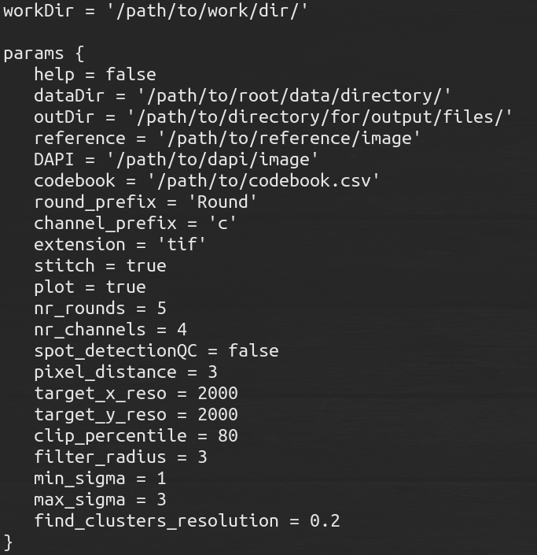

# Configuration

Configuration of your pipeline run is done by first generating a .config file that contains all parameters you need for the specific profile chosen. This is generated as follows:

 ```bash
nextflow config -profile iss >> iss_exp.config
  ```
Which will result in a file called *iss_exp.config*, which will look like this:



Using the ```` nextflow config ```` command under the hood combines all premade config files of the different profiles given as input to it. However when it does this, it removes all comments in them, meaning that adding explanation to them is not possible. That is why this page serves as an overview and explanation of the different parameters you could fill in after generating a specific profile config.

In general, it is very important that filepaths to the dataDir, workDir and outDir are absolute paths and not relative ones, since subsequent commands will be run in intermediately created directories.

## Available profiles

* [iss](#iss)
* [merfish](#merfish)


### ISS


